# Customer Churn Prediction — Interpretable Data Science

A group assignment for the **Interpretable Data Science** course. We build and compare churn prediction models for a telecommunications company, with a strict focus on *interpretability* alongside predictive performance.

**Team:** Duc Manh Nguyen · Minh Hoan Tran · Qiushuang Liu

---

## Table of Contents

1. [Project Overview](#project-overview)
2. [Dataset](#dataset)
3. [Exploratory Data Analysis](#exploratory-data-analysis)
4. [Preprocessing](#preprocessing)
5. [Model Comparison](#model-comparison)
6. [Interpretability Analysis](#interpretability-analysis)
7. [Key Results & Recommendation](#key-results--recommendation)
8. [Business Recommendations](#business-recommendations)
9. [Folder Structure](#folder-structure)
10. [How to Run](#how-to-run)
11. [Dependencies](#dependencies)

---

## Project Overview

A telecom company loses significant revenue each time a customer churns. Acquiring a new customer costs 5–10× more than retaining one, and the company's retention budget only reaches the **top 25% highest-risk customers**. The model must therefore:

1. **Rank customers accurately** — measured by ROC-AUC
2. **Precisely target actual churners in the top 25%** — measured by Precision@Top25%
3. **Remain interpretable** — agents use model outputs operationally; a black-box breaks their workflow

---

## Dataset

- **File:** `data/churn_2024.csv`
- **Size:** 10,000 customers x 19 columns (18 features + 1 binary target)
- **Target:** `churn` — 1 = churned, 0 = retained
- **Missing values:** None

**Feature groups:** account demographics (`state`, `account_length`), binary plan subscriptions (`international_plan`, `voice_mail_plan`, `wifi_bundle`, `phone_bundle`), usage metrics (`total_usage`, `total_intl_calls`), service quality (`number_service_outage`), customer service (`number_customer_service_calls`), and financial (`discount`).

---

## Exploratory Data Analysis

### Class Balance

The dataset has a moderate class imbalance: approximately **27% of customers churned**. This rules out raw accuracy as a useful metric — a model predicting "never churn" would score 73% accuracy while catching zero churners. This motivates using ROC-AUC and Precision@Top25% instead.

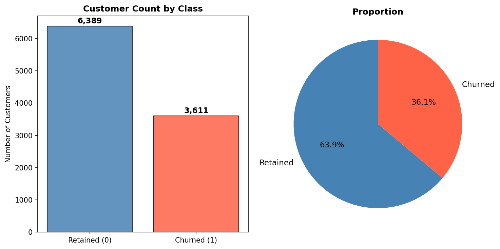

---

### Feature Distributions by Churn Status

Each numeric feature is visualised as overlapping KDE histograms — churned customers in one colour, retained in another. Features where both distributions are clearly separated are strong churn signal candidates; heavy overlap indicates low importance. Several features including `number_service_outage`, `total_usage`, and `number_customer_service_calls` show clear distributional separation.

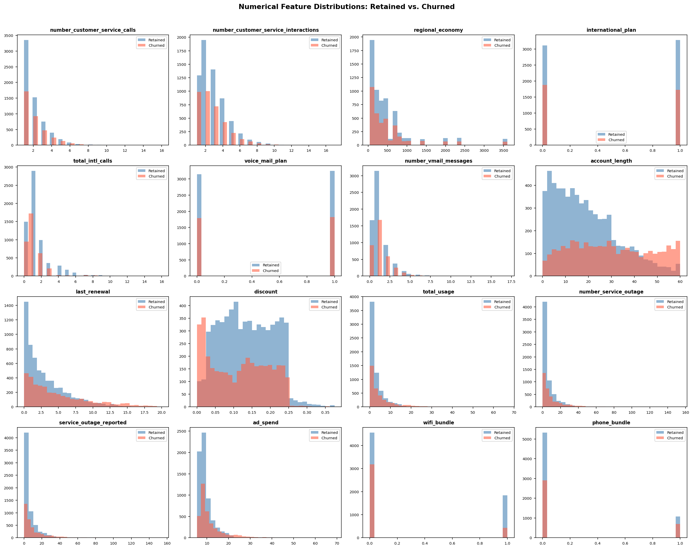

---

### Binary Feature Churn Rates

The four binary plan features (`international_plan`, `voice_mail_plan`, `wifi_bundle`, `phone_bundle`) are evaluated by comparing churn rates between subscribers and non-subscribers. The standout finding: **WiFi bundle non-subscribers churn at 41.1%** versus only **18.9% for subscribers** — the largest single binary signal in the dataset.

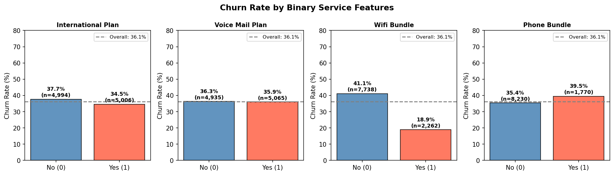

---

### Correlation Matrix

A lower-triangle heatmap of pairwise Pearson correlations across all numeric features. Several pairs show high correlation, flagging potential multicollinearity that needs formal VIF analysis. Notably, `service_outage_reported` and `number_service_outage` are nearly perfectly correlated, as are `ad_spend` and `total_usage`.

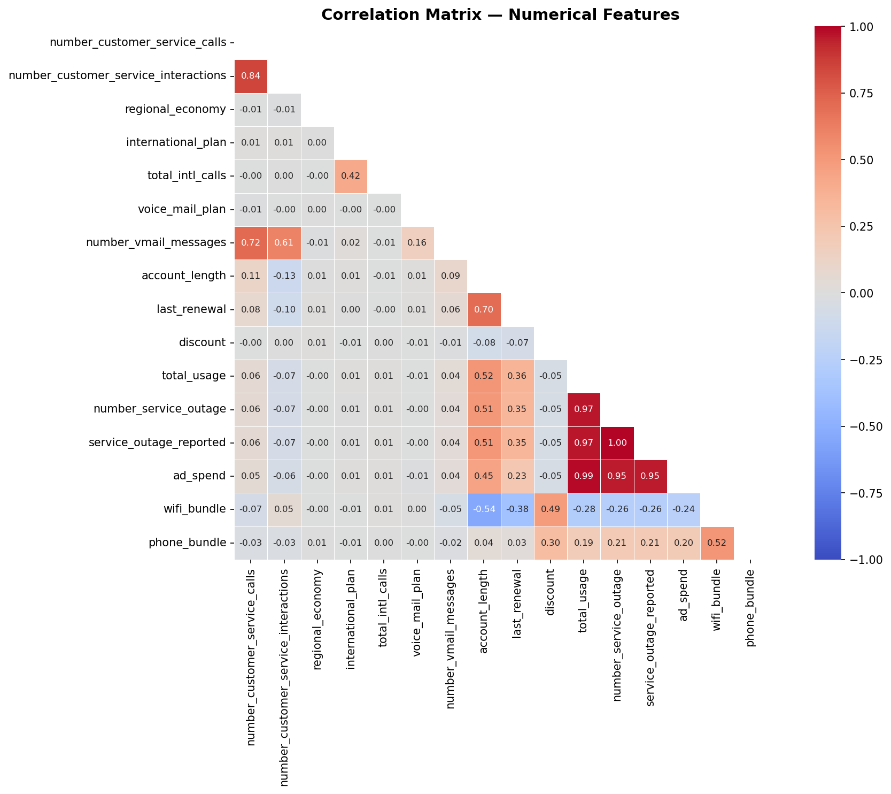

---

### Multicollinearity — VIF Analysis

Pairwise correlations only detect bilateral relationships. The **Variance Inflation Factor (VIF)** captures broader multicollinearity: three features had catastrophic VIF scores that would make Logistic Regression coefficients meaningless if left in.

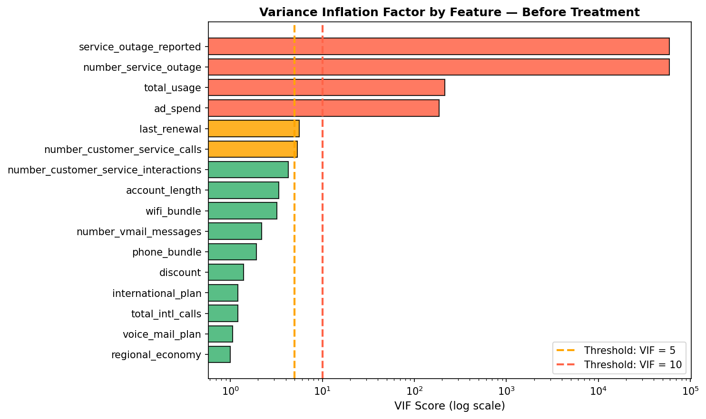

| Feature dropped | VIF | Reason |
|---|---|---|
| `service_outage_reported` | > 50,000 | Near-perfect linear duplicate of `number_service_outage` |
| `ad_spend` | > 100 | Derived directly from `total_usage` |
| `number_customer_service_interactions` | ~ 5 | Superset of `number_customer_service_calls` |

After treatment, all remaining VIF scores fell below 16. Two features (`total_usage`, `number_service_outage`) were retained at VIF ~15 despite residual correlation because both are among the strongest predictors — a deliberate, documented trade-off.

---

## Preprocessing

| Step | Detail |
|---|---|
| Dropped features | `service_outage_reported`, `ad_spend`, `number_customer_service_interactions` |
| Feature engineering | `calls_per_month = calls / account_length`, `usage_intensity = total_usage / account_length`, `frustration_index = outages x calls` |
| Encoding | One-hot encoding on `state` with `drop_first=True` (avoids dummy variable trap) |
| Split | 60% train / 20% validation / 20% test, stratified on `churn` |
| Scaling | `StandardScaler` fit on training set only — prevents data leakage |

The three engineered features are domain-informed proxies: `frustration_index` in particular captures customers who both experience service outages *and* escalate to customer service — the combined signal for acute churn risk.

---

## Model Comparison

We trained and tuned four model families using `GridSearchCV` (5-fold CV, scored by ROC-AUC) on the training set. The test set was never touched during training or model selection.

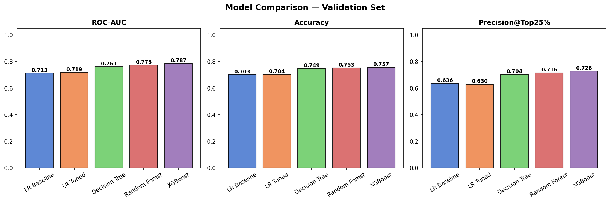

| Model | ROC-AUC (Val) | Precision@Top25% (Val) | Interpretability |
|---|---|---|---|
| LR Baseline | 0.713 | 63.6% | Full — coefficients |
| Tuned LR (L1, C=0.1) | 0.719 | 63.0% | Full — coefficients |
| Decision Tree (depth 5) | 0.762 | 70.4% | Full — IF-THEN rules |
| Random Forest (depth 10) | 0.773 | 71.6% | Partial — feature importance |
| XGBoost | 0.787 | 72.8% | None — post-hoc only |

**Key observation:** The Decision Tree is only 2.4 pp behind XGBoost in Precision@Top25%, while remaining fully interpretable via readable IF-THEN rules. The gap between Tuned LR and XGBoost is ~10 pp — meaningful but justified by the interpretability gain for operational use.

---

## Interpretability Analysis

### Logistic Regression Coefficients

Because all features were standardised (mean = 0, std = 1), the LR coefficients are directly comparable across variables — a coefficient of 0.5 has exactly twice the impact of 0.25. L1 regularisation automatically zeroed out many state dummy variables, confirming that geography adds little predictive power beyond behavioural features.

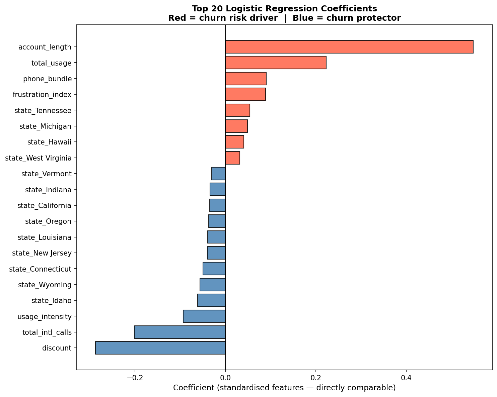

**Top positive drivers (increase churn risk):**
- `number_service_outage` — service reliability is the primary churn trigger
- `frustration_index` — the combined signal of outages AND service calls is the strongest composite predictor
- `account_length` — counter-intuitively, longer-tenured customers churn more; warrants business investigation

**Top protective factors (decrease churn risk):**
- `discount` — targeted discounts are highly effective; validates the pricing strategy
- `wifi_bundle` — bundle subscribers are significantly stickier
- `total_intl_calls` — international callers are loyal; they value the network specifically

---

### Decision Tree Visualisation

A Decision Tree's entire prediction logic can be visualised as a flowchart. Every internal node is a binary split rule; every leaf shows predicted class probabilities. A business agent can follow any customer's prediction from root to leaf in a few steps with no technical background required.

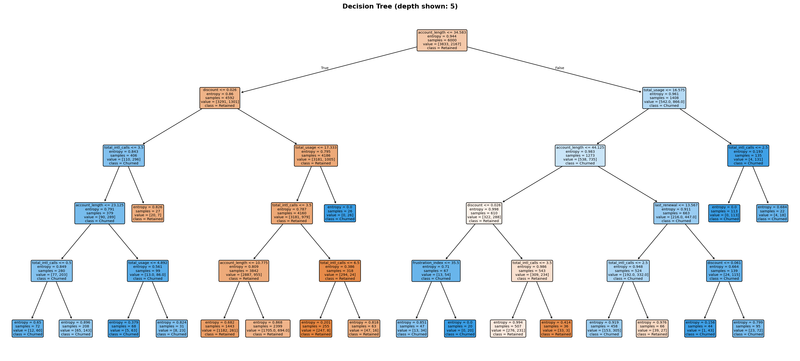

---

### Feature Importance — Random Forest vs. XGBoost

Both ensemble models rank features by importance using different internal metrics (Gini decrease for RF, split frequency for XGBoost). Consistent rankings across both models provide stronger evidence that a feature is genuinely informative rather than a model-specific artefact.

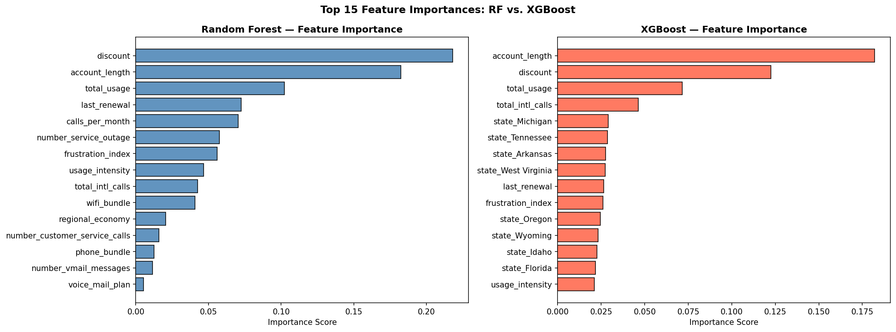

Both models agree that `total_usage`, `account_length`, `number_service_outage`, and `discount` are the dominant predictors — consistent with the LR coefficient analysis and SHAP results.

---

### Partial Dependence Plots (PDP)

PDPs show the **average marginal effect** of a single feature on predicted churn probability, averaged across all customers. They answer: *"On average, how does churn probability change as this feature increases?"*

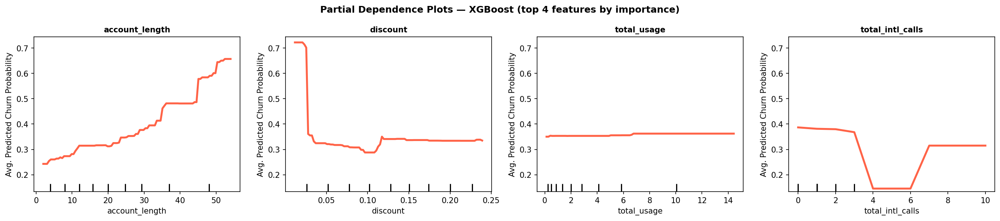

Limitation: PDPs assume feature independence. When features are correlated (as documented above), the PDP may average over unrealistic combinations. ALE plots below address this.

---

### Individual Conditional Expectation (ICE) Plots

ICE plots extend PDPs by showing the dependence curve for **each individual customer** rather than just the mean. Parallel ICE curves confirm the PDP is representative; crossing curves reveal interaction effects with other variables.

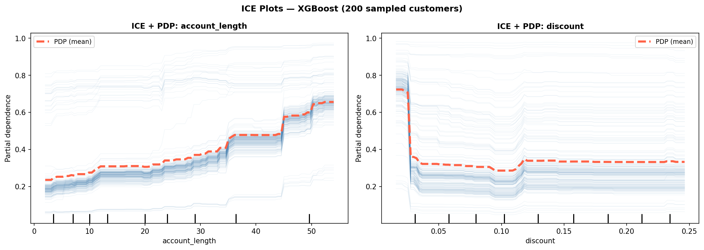

The crossing patterns visible here reveal that the effect of certain features differs substantially across customer subgroups — the average PDP masks real heterogeneity.

---

### Accumulated Local Effects (ALE)

ALE plots are the most robust alternative to PDPs when features are correlated. Rather than averaging over the full distribution (which can include unrealistic feature combinations), ALE accumulates the *local* effect of small feature changes within narrow bins — always staying within the observed data.

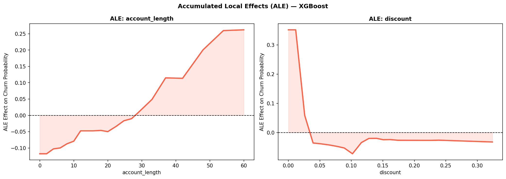

The y-axis is centred at zero: a positive ALE value at a given feature value means that value pushes predicted churn probability above the baseline average.

---

### Global Surrogate Model

A Global Surrogate is an interpretable model (Decision Tree, depth 4) trained to approximate the **predictions of XGBoost** — not the true labels. It produces a readable proxy explanation of the black-box.

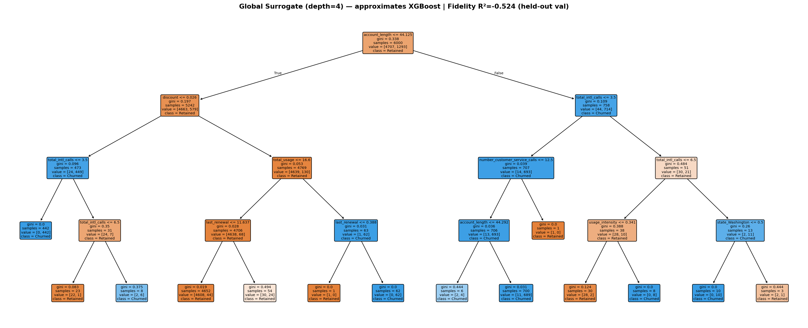

| Metric | Value | Interpretation |
|---|---|---|
| Decision agreement | 99.1% | Surrogate predicts the same class as XGBoost for 99.1% of validation customers |
| Fidelity R2 | -0.52 | Probability outputs are poorly calibrated — the surrogate explains *decisions*, not probabilities |

The surrogate is useful for communicating XGBoost's logic, but it explains the model — not reality. If XGBoost is wrong about something, the surrogate faithfully reproduces that error.

---

### SHAP — Global Feature Importance

SHAP (SHapley Additive exPlanations) is grounded in cooperative game theory. Each feature's SHAP value is its exact contribution to a specific prediction, guaranteed to sum to the difference between that prediction and the global average.

**Bar chart** — mean absolute SHAP value per feature (overall importance ranking):

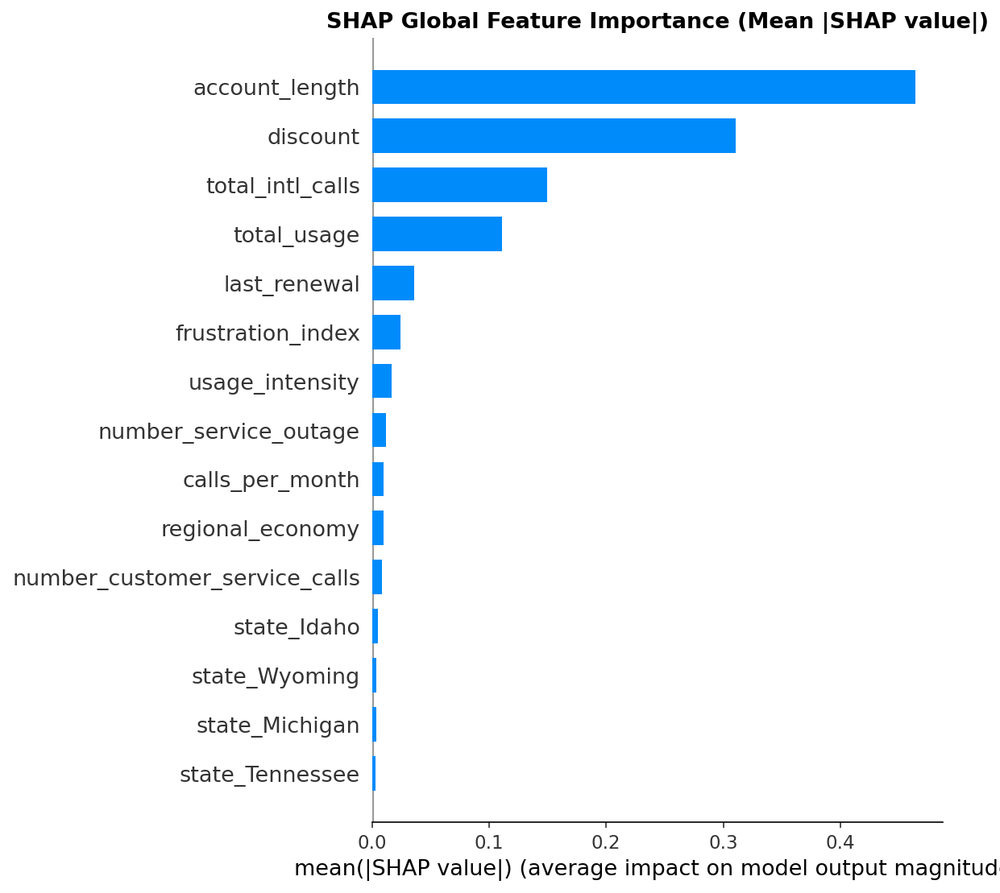

**Beeswarm plot** — each dot is one customer; horizontal position = SHAP value; colour = feature value (red = high, blue = low). This combines importance *and* direction in a single view:

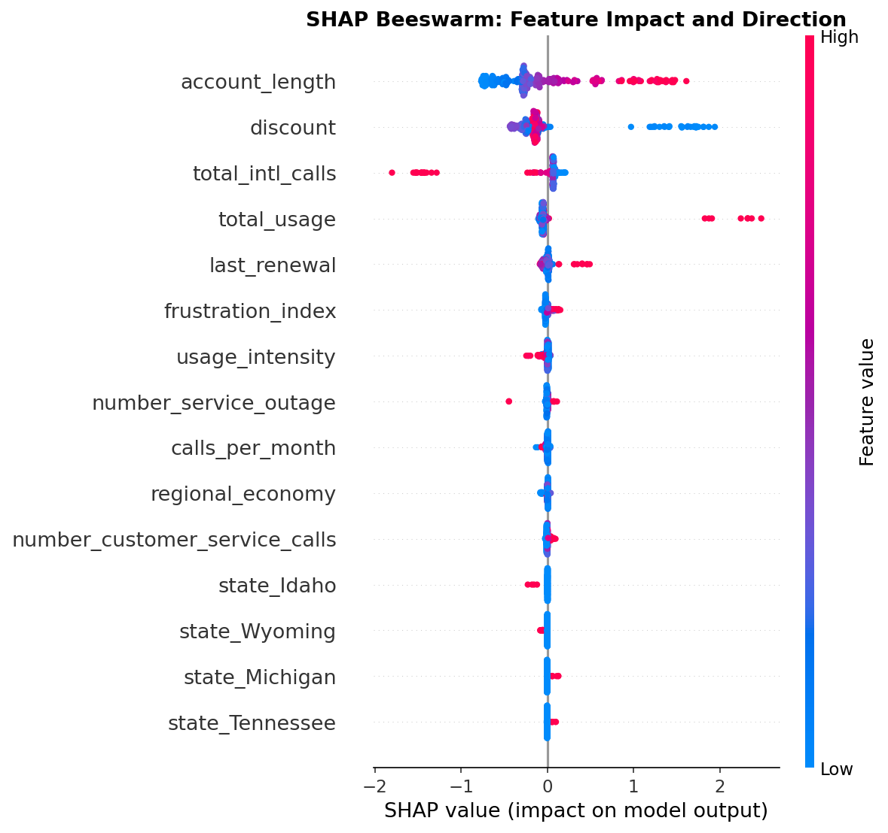

The beeswarm confirms the LR coefficient findings at scale: high `total_usage` and long `account_length` are the two largest positive SHAP contributors; higher `discount` values consistently push SHAP negative (protective).

---

## Key Results & Recommendation

**Final test-set performance (2,000 held-out customers, never seen during training):**

| Model | ROC-AUC (Test) | Precision@Top25% (Test) |
|---|---|---|
| **Tuned LR (Recommended)** | **0.695** | **60.4%** |
| XGBoost | 0.766 | 70.8% |

**Final recommendation: Tuned Logistic Regression (L1, C=0.1)**

The ~10 pp gap in Precision@Top25% versus XGBoost is real but acceptable given the interpretability gain. In a 10,000-customer retention campaign targeting the top 25% (2,500 customers), this corresponds to roughly **260 additional correctly identified churners per cycle** — meaningful, but modest compared to the operational cost of deploying and explaining a black-box model to a non-technical team.

With LR, every agent can open a coefficient table, understand exactly which customer behaviours drive the score, and explain any individual flagging decision in plain language. XGBoost cannot do this natively.

**Decision Tree as a strong alternative:** Only a 2.4 pp gap vs. XGBoost on validation. If business stakeholders require higher precision and are willing to work with IF-THEN rules rather than coefficients, a depth-5 Decision Tree is the practical champion.

---

## Business Recommendations

**1. Run a weekly churn scoring cycle targeting the top 25%.**
The model's Precision@Top25% substantially exceeds the 27% base rate. Configure a weekly refresh of churn scores and trigger a retention workflow for every customer entering the top decile for the first time — these are newly at-risk and most likely to respond to early intervention.

**2. Treat every service outage as an immediate churn signal.**
`number_service_outage` and `frustration_index` (outages x service calls) are the strongest positive drivers in both the LR coefficients and SHAP analysis. Implement an automated alert that flags any customer who experienced a service outage in the past 30 days for proactive outreach — before they escalate.

**3. Deploy discounts surgically, not broadly.**
The `discount` coefficient and SHAP value confirm that price sensitivity is real and targeted discounts work. Broad discounting reduces margin without selectivity. Deploy offers only to model-flagged customers.

**4. Investigate long-tenured customers urgently.**
`account_length` is a top positive driver — longer-tenured customers churn more, which is counter-intuitive. This warrants a dedicated business investigation. A loyalty recognition programme (upgrade offers, tenure rewards) may be more effective than price reduction for this segment.

**5. Retrain quarterly.**
Trigger a full retraining cycle if validation ROC-AUC drops more than 3 points below the current benchmark (0.719), or whenever significant product or pricing changes occur.

---

## Folder Structure

```
.
├── README.md                  <- You are here
├── .gitignore
├── requirements.txt
│
├── notebook/
│   ├── Notebook.ipynb         <- Full analysis: EDA -> modelling -> interpretability
│   └── README.md
│
├── data/
│   ├── churn_2024.csv         <- Raw dataset (10,000 customers, 18 features + target)
│   └── README.md
│
├── outputs/
│   ├── charts/                <- 15 PNG figures generated by the notebook
│   └── README.md
│
├── slides/
│   ├── Slide.pdf              <- Project presentation deck
│   └── README.md
│
└── references/
    ├── Assignment_Group.pdf   <- Original project brief
    ├── 0 - Introduction.pdf
    ├── 1 - Intrinsically Interpretable Models.pdf
    ├── 2 - Model Agnostic Interpretability Methods.pdf
    └── 3 - Gradient-based Interpretability Methods.pdf
```

---

## How to Run

```bash
# 1. Clone the repository
git clone <repo-url>
cd <repo-folder>

# 2. Install dependencies
pip install -r requirements.txt

# 3. Launch the notebook
jupyter notebook notebook/Notebook.ipynb
```

> **Note:** The notebook loads data from `data/churn_2024.csv`. All charts are saved automatically to `outputs/charts/` when cells are run.

---

## Dependencies

| Library | Purpose |
|---|---|
| `pandas`, `numpy` | Data manipulation |
| `matplotlib`, `seaborn` | Visualisation |
| `scikit-learn` | Preprocessing, model training, GridSearchCV, PDP/ICE |
| `xgboost` | XGBoost classifier |
| `statsmodels` | VIF (multicollinearity analysis) |
| `shap` | SHAP global and local explanations (TreeExplainer) |
| `lime` | LIME local explanations |
| `PyALE` | Accumulated Local Effects plots |

All random operations use `RANDOM_STATE = 42`. Run all cells top-to-bottom in a fresh kernel to reproduce every result exactly.
